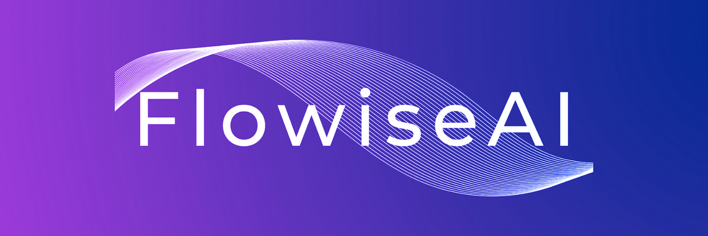

#  Hey there! I'm Mohamed Osama (a.k.a. DevDodge) 

> **(`Oracle Expert` / `Full-Stack Java Developer` / `System Designer` / `Flowise AI Builder`)**

> I'm a `passionate developer` who loves building smart systems that solve real problems. With years of experience in `Java`, `AI tools`, and `database design`, I enjoy turning ideas into secure, high-performance software. My background in `desktop apps`, `microservices`, and `Flowise chatbots` gives me a strong edge when working on creative and technical projects.

-----

 

-----

## 🔥 About Me

- 🧠 Java Spring Boot addict, with expertise in Microservices & Dockerized architectures.
- 🤖 AI enthusiast, worked on AI-based health prediction systems & chatbot flows using Flowise.
- 🛠 Desktop development pro with a strong foundation in Oracle DB, security, and optimization.
- 💻 Full-stack problem solver who built solutions for cryptocurrency, government systems, and internal tools.
- ✨ My development style mixes performance, encryption, and slick backend logic.
- 💬 I’m very active in conversations with clients, mentoring juniors, and handling system analysis.

  ## <picture>  </picture> Connect with me

	
	
	        
	
	
 
 

## 🚀 My favorite tools and technologies ⚙️

> Technologies that fuel my curiosity, projects, and continuous growth.

<table>
  <tr>
    <td align="center" width="96">
        
       Java
    </td>
    <td align="center" width="96">
        
       Docker
    </td>
    <td align="center" width="96">
        
       Node.js
    </td>
    <td align="center" width="96">
        
       JavaScript
    </td>
    <td align="center" width="96">
        
       TypeScript
    </td>
    <td align="center" width="96">
        
       Python
    </td>
    <td align="center" width="96">
        
       MySQL
    </td>
    <td align="center" width="105">
        
       Oracle DB
    </td>
    <td align="center" width="120">
        
       Flowise AI
    </td>
  </tr>
 <tr>
    <td align="center" width="96">
        
      MCP
    </td>
    <td align="center" width="96">
        
       Django
    </td>
    <td align="center" width="96">
        
       Git
    </td>    
    <td align="center" width="96">
        
       Rest API
    </td>
    <td align="center" width="115">
        
       Spring Boot
    </td>
    <td align="center" width="115">
        
       Microservices
    </td>
    <td align="center" width="96">
        
       NPM
    </td>
    <td align="center" width="96">
        
       Jaspersoft
    </td>
    <td align="center" width="145">
        
       Scene Builder
    </td>
 </tr>
</table>

## 📜 Projects & Highlights

- 🔐 Built a **crypto trading system** with secure database logic & encryption for clients in Thailand.
- 📊 Delivered a complete **heart attack prediction system** using AI & Django MVC framework.
- 🖥 Developed Java desktop systems with trial licensing, hardware security, and internationalization.
- 🤝 Participated in and won local AI-enhanced website competitions using SEO and Google Analytics.
- 💬 Built Flowise AI chatbot solutions for internal data queries, and integrated them with backend DBs.
## 🔥 GitHub Streak Stats

<table align="center" cellspacing="0" cellpadding="0">
  <tr>
    <td>
      
    </td>
    <td valign="middle">
      
    </td>
    <td valign="middle">
	    <h4 align="center">Visitor's count :eyes:</h4>
      

    </td>
  </tr>
</table>

## 🐍 My GitHub Contributions

<picture>
  <source
    media="(prefers-color-scheme: dark)"
    srcset="https://raw.githubusercontent.com/platane/snk/output/github-contribution-grid-snake-dark.svg"
  />
  <source
    media="(prefers-color-scheme: light)"
    srcset="https://raw.githubusercontent.com/platane/snk/output/github-contribution-grid-snake.svg"
  />
  
</picture>
